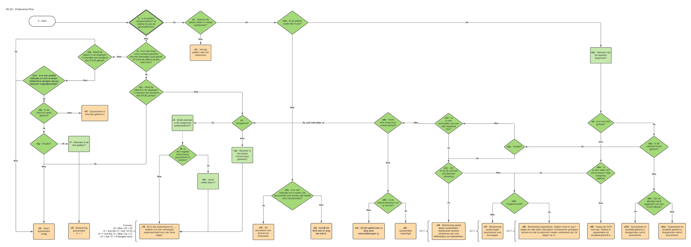

# Quarantine Calculator - MD
The quarantine calculator is a simple front-end application helping health professionals to calculate
the number of days a patient should remain in quarantine, based on the ruleset of __Sciensano__. 

## What is Sciensano?
Taken from their website:

> As our name suggests, science and health are central to our mission. Sciensano’s strength and uniqueness lie within the holistic and multidisciplinary approach to health. More particularly we focus on the close and indissoluble interconnection between human and animal health and their environment (the “One health” concept). By combining different research perspectives within this framework, Sciensano contributes in its unique way to everybody’s health.

Read on: https://www.sciensano.be/en/about-sciensano 

## Rationale
Sciensano plays an important role in mastering the Covid-19 crisis. They issue a lot of information and guidelines
for health professionals and individuals. One of them is the documentation on how to calculate 
quarantine for a patient. Those flows are complex and not really handy to use in a day to day basis when the health
professionals have a task overflow and should make decisions quickly and correclty.

This app is developed to answer the following questions:
- Should a patient be placed in quarantine, and if so, how many days?
- Should we take extra measures?

The app was hence developed as a mobile-first application where you can easily tap through. 

Sciensano documentation:
https://covid-19.sciensano.be/nl/covid-19-procedures

## Implemented workflow
The flows of Sciensano were abstracted in a flow consisting of the following question types:

- Informational question (Next question)
- Yes/No question
- Days ago question, answers questions like 'how many days ago did the symptoms start'

This results in a flow whith **simple** and unambiguous questions, which helps the health professional
to get the correct result.

## Read on
[Privacy statments](./privacy.md)
[Contribute to the project](./contributing.md)

